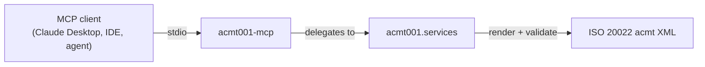

# acmt001-mcp: An MCP Server for ISO 20022 Account Management

![acmt001-mcp banner][banner]

[![PyPI Version][pypi-badge]][07]
[![Python Versions][python-versions-badge]][07]
[![PyPI Downloads][pypi-downloads-badge]][07]
[![Licence][licence-badge]][01]
[![Tests][tests-badge]][tests-url]
[![Quality][quality-badge]][quality-url]
[![Documentation][docs-badge]][docs-url]

**A [Model Context Protocol][mcp] server that exposes the [`acmt001`][core]
ISO 20022 Account Management library as tools for AI agents and assistants** —
discover message types, inspect input schemas, validate records and financial
identifiers, and generate validated XML, all from your favourite MCP client.

> **Latest release: v0.0.1** — six MCP tools over stdio, all backed by the
> shared `acmt001.services` layer, for Python 3.10+.
> [See what's new →][release-001]

## Contents

- [Overview](#overview)
- [Install](#install)
- [Quick Start](#quick-start)
- [Tools](#tools)
- [Using the tools](#using-the-tools)
- [Development](#development)
- [Licence](#licence)
- [Contribution](#contribution)
- [Acknowledgements](#acknowledgements)

## Overview

The [Model Context Protocol][mcp] (MCP) is an open standard that lets AI agents
and assistants discover and call external tools in a uniform way. **acmt001-mcp**
is an MCP server that turns the [`acmt001`][core] library into a set of
first-class agent tools, so an assistant can generate and validate **ISO 20022
`acmt` Account Management XML messages** — the standardised instructions,
confirmations, and reports that govern the lifecycle of a bank account (opening,
maintenance, closing, identification, and switching) — directly from a
conversation.

Every tool is a thin, typed wrapper over `acmt001.services` — the single shared
facade also used by the CLI and REST API — so all interfaces behave identically.
Tools return JSON-serialisable data; on a validation error they return an
`{"error": ...}` payload rather than raising.

- **Website:** <https://acmt001.com>
- **Source code:** <https://github.com/sebastienrousseau/acmt001-mcp>
- **Bug reports:** <https://github.com/sebastienrousseau/acmt001-mcp/issues>

This package is part of the **acmt001 suite** — a set of independently
installable packages that share the `acmt001.services` layer:

- [`acmt001`][core] — the core library (CLI + REST API)
- `acmt001-mcp` — this package, the **Model Context Protocol** server
- [`acmt001-lsp`][lsp] — the **Language Server Protocol** server for editors



## Install

**acmt001-mcp** runs on macOS, Linux, and Windows and requires **Python 3.10+**
and **pip**. It pulls in the core `acmt001` library and the MCP SDK
automatically.

```sh
python -m pip install acmt001-mcp
```

> **Note:** while the core `acmt001` library is not yet on PyPI, install it from
> source first:
>
> ```sh
> python -m pip install "git+https://github.com/sebastienrousseau/acmt001.git"
> python -m pip install acmt001-mcp
> ```

<details>
<summary>Using an isolated virtual environment (recommended)</summary>

```sh
python -m venv venv
source venv/bin/activate        # macOS/Linux
venv\Scripts\activate           # Windows
python -m pip install -U acmt001-mcp
```
</details>

## Quick Start

Launch the server over stdio (the FastMCP default transport):

```sh
acmt001-mcp
```

Register it with any MCP client (e.g. Claude Desktop) by adding it to the
client's configuration:

```json
{
  "mcpServers": {
    "acmt001": { "command": "acmt001-mcp" }
  }
}
```

The agent can then call the tools below to validate account data and generate
ISO 20022 messages on demand.

## Tools

All tools delegate to the shared `acmt001.services` layer, so they behave
identically to the CLI and REST API.

| Tool | Purpose |
|------|---------|
| `list_message_types` | List the 34 supported acmt message types |
| `get_required_fields` | Required input fields for a message type |
| `get_input_schema` | Full input JSON Schema for a message type |
| `validate_records` | Validate flat records against a message type |
| `validate_identifier` | Validate an IBAN, BIC, or LEI |
| `generate_message` | Generate a validated acmt XML message |

## Using the tools

You can invoke the tools in-process — without a transport — straight through the
FastMCP instance. This mirrors what an agent receives over stdio. The runnable
version of this snippet lives in [`examples/mcp_tools.py`](examples/mcp_tools.py).

```python
import asyncio

from acmt001_mcp.server import server

# A single flat account-opening record.
record = [
    {
        "msg_id": "ACMT-MSG-0001",
        "creation_date_time": "2026-01-15T10:30:00",
        "process_id": "ACMT-PRC-0001",
        "account_id": "GB29NWBK60161331926819",
        "account_currency": "EUR",
        "account_name": "Treasury Operating Account",
        "account_type_cd": "CACC",
        "account_servicer_bic": "NWBKGB2LXXX",
        "account_owner_name": "Acme Embedded Finance Ltd",
        "account_owner_country": "GB",
        "org_full_legal_name": "Acme Embedded Finance Limited",
        "org_country_of_operation": "GB",
        "org_id_lei": "5493001KJTIIGC8Y1R12",
    }
]


async def main() -> None:
    async def call(name, args):
        result = await server.call_tool(name, args)
        content = result[0] if isinstance(result, tuple) else result
        return content[0].text if content else ""

    # Validate an identifier.
    print(await call("validate_identifier",
                     {"kind": "lei", "value": "5493001KJTIIGC8Y1R12"}))
    # -> {"kind": "lei", "value": "5493001KJTIIGC8Y1R12", "valid": true}

    # Generate a validated ISO 20022 Account Opening Request.
    xml = await call("generate_message",
                     {"message_type": "acmt.007.001.05", "records": record})
    print(xml[:46])  # -> <?xml version="1.0" encoding="UTF-8"?> ...


asyncio.run(main())
```

Run it directly:

```sh
python examples/mcp_tools.py
```

## Development

**acmt001-mcp** uses [Poetry](https://python-poetry.org/) and
[mise](https://mise.jdx.dev/).

```bash
git clone https://github.com/sebastienrousseau/acmt001-mcp.git && cd acmt001-mcp
mise install
poetry install
poetry shell
```

> This package depends on the core `acmt001` library. Until it is on PyPI,
> install it from source first:
> `pip install "git+https://github.com/sebastienrousseau/acmt001.git"`.

A `Makefile` orchestrates the quality gates (kept in lockstep with CI):

```bash
make check        # all gates (REQUIRED before commit)
make test         # pytest
make lint         # ruff + black
make type-check   # mypy --strict
```

## Licence

Licensed under the [Apache Licence, Version 2.0][01]. Any contribution submitted
for inclusion shall be licensed as above, without additional terms.

## Contribution

Contributions are welcome — see the [contributing instructions][04]. Thanks to
all [contributors][05].

## Acknowledgements

Built on the [`acmt001`][core] ISO 20022 Account Management library and the
[Model Context Protocol][mcp] Python SDK.

[01]: https://opensource.org/license/apache-2-0/
[04]: https://github.com/sebastienrousseau/acmt001-mcp/blob/main/CONTRIBUTING.md
[05]: https://github.com/sebastienrousseau/acmt001-mcp/graphs/contributors
[07]: https://pypi.org/project/acmt001-mcp/
[core]: https://github.com/sebastienrousseau/acmt001
[lsp]: https://github.com/sebastienrousseau/acmt001-lsp
[mcp]: https://modelcontextprotocol.io
[release-001]: https://github.com/sebastienrousseau/acmt001-mcp/releases/tag/v0.0.1
[banner]: https://kura.pro/acmt001-mcp/images/banners/banner-acmt001-mcp.svg 'acmt001-mcp'
[docs-badge]: https://img.shields.io/badge/Docs-acmt001.com-blue?style=for-the-badge
[docs-url]: https://acmt001.com/
[licence-badge]: https://img.shields.io/pypi/l/acmt001-mcp?style=for-the-badge
[pypi-badge]: https://img.shields.io/pypi/v/acmt001-mcp?style=for-the-badge
[pypi-downloads-badge]: https://img.shields.io/pypi/dm/acmt001-mcp.svg?style=for-the-badge
[python-versions-badge]: https://img.shields.io/pypi/pyversions/acmt001-mcp.svg?style=for-the-badge
[quality-badge]: https://img.shields.io/github/actions/workflow/status/sebastienrousseau/acmt001-mcp/ci.yml?branch=main&label=Quality&style=for-the-badge
[quality-url]: https://github.com/sebastienrousseau/acmt001-mcp/actions/workflows/ci.yml
[tests-badge]: https://img.shields.io/github/actions/workflow/status/sebastienrousseau/acmt001-mcp/ci.yml?branch=main&label=Tests&style=for-the-badge
[tests-url]: https://github.com/sebastienrousseau/acmt001-mcp/actions/workflows/ci.yml
